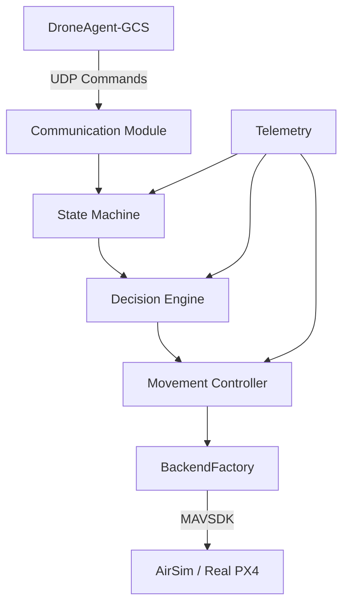

# DroneNode 

DroneNode is the central intelligence node of the Autonomous Drone System Architecture. It sits between the MAVSDK backend (AirSim/Real PX4) and the DroneAgent-GCS.

## Architecture



## Configuration

DroneNode is entirely configured via YAML. The exact same source code runs on both AirSim and Real drones.

To switch between modes, simply update the `mode` field:
```yaml
# config/simulation.yaml
mode: "simulation"
connection:
  type: "udp"
  url: "udp://:14540"

# config/real.yaml
mode: "real"
connection:
  type: "serial"
  url: "/dev/ttyACM0:57600"
```

The system features strict startup validation. `config.py` validates types, unique ports, and valid IP addresses, immediately exiting the boot sequence on failure.

## Subsystems and Pipeline

- **State Machine**: The sole arbiter of logic. GCS commands MUST transition through the State Machine (e.g. `BOOT -> CONNECTING -> CONNECTED -> READY -> ARMED -> TAKEOFF -> HOVER`).
- **Watchdog**: A robust health checker that isolates and reboots crashed subsystem threads (`Telemetry`, `Heartbeat`, etc.) without dropping the drone.
- **Failsafe**: Contextually aware. Defaults to RTL if GPS is accurate, but bypasses to Emergency `LAND` if GPS signals are lost or heavily degraded.

## Acknowledgement Pipeline

All commands sent from the GCS execute through a 4-stage pipeline:
1. **Accepted**: Received securely by the node.
2. **Executing**: State transition authorized and processing.
3. **Completed**: Target state reached (e.g. `HOVER` achieved).
4. **Failed**: Detailed error payload if aborted.

## Startup and Shutdown

Start DroneNode by passing your configuration YAMLs (ordered by override priority):
```bash
python3 drone_main.py config/base.yaml config/simulation.yaml config/drone1.yaml
```

Graceful Shutdown is achieved by catching `SIGINT`/`SIGTERM`. The node sends a `land` override to the backend, closes UDP sockets, terminates event loops, and safely joins threads.
