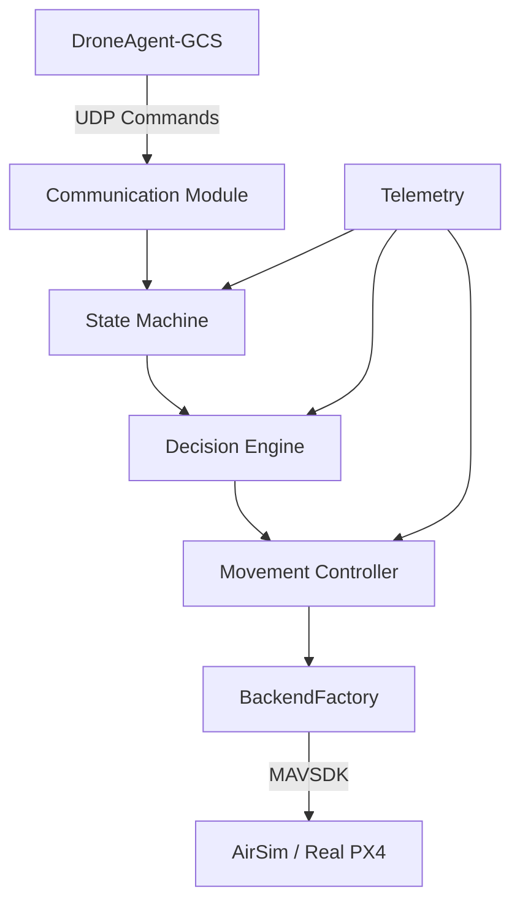

# Decentralized LLm Swarm

## Overview
This repository contains the software stack for an Autonomous Drone System Architecture, enabling decentralized control and coordination. It consists of two main components:
- **DroneAgent-GCS**: The Ground Control Station (GCS) application with a graphical user interface.
- **DroneNode**: The headless, central intelligence node designed to run on a companion computer (e.g., Raspberry Pi) onboard the drone, interfacing with MAVSDK for flight control.

## Features
- **Decentralized Architecture**: Separation of concerns between the GCS and the onboard drone node.
- **DroneNode Intelligence**: Built-in state machine, decision engine, and movement controller.
- **Cross-Platform Compatibility**: Supports both Simulation (AirSim) and Real Drones (PX4) via configuration files.
- **Robustness**: Includes a watchdog for subsystem thread monitoring, contextual failsafes (RTL vs Emergency Land), and a 4-stage execution acknowledgement pipeline.
- **Strict Configuration**: YAML-based configuration with strict startup type validation.
- **Graphical Control**: PySide6-based GCS interface for remote monitoring and command dispatch.

## Architecture

The system utilizes a UDP-based communication pipeline between the GCS and DroneNode.



## Project Structure
- `DroneAgent-GCS/`: Contains the Ground Control Station code.
  - GUI implementation using PySide6.
  - UDP Packet communication and logging.
- `DroneNode/`: Contains the onboard drone logic.
  - Integration with MAVSDK and pymavlink.
  - State machine, heartbeat, telemetry, planner, mission, and collision handling.
  - Simulation and real backend implementations.

## Technology Stack
- **Python 3**: Core programming language for all components.
- **MAVSDK / pymavlink**: For drone telemetry and control (DroneNode).
- **PySide6**: For the Ground Control Station GUI.
- **PyYAML**: For configuration management.

## Requirements
### DroneAgent-GCS (Laptop/Desktop)
- Python 3
- PySide6
- PyYAML>=6.0.1

### DroneNode (Raspberry Pi/Companion Computer)
- Python 3
- mavsdk>=2.8.0
- pymavlink
- PyYAML>=6.0.1

## Installation
1. Clone the repository.
2. For the GCS:
   ```bash
   cd DroneAgent-GCS
   python3 -m venv venv
   source venv/bin/activate
   pip install -r requirements.txt
   ```
3. For the DroneNode:
   ```bash
   cd DroneNode
   python3 -m venv venv
   source venv/bin/activate
   pip install -r requirements.txt
   ```

## Configuration
Both subsystems utilize YAML files in their respective `config/` directories.

Example DroneNode configuration for switching modes:
```yaml
# config/simulation.yaml
mode: "simulation"
connection:
  type: "udp"
  url: "udp://:14540"

# config/real.yaml
mode: "real"
connection:
  type: "serial"
  url: "/dev/ttyACM0:57600"
```

## Usage
### Starting the GCS
```bash
cd DroneAgent-GCS
./start_gcs.sh
# Alternatively: python3 gcs_main.py
```

### Starting the DroneNode
Launch the DroneNode by providing the configuration files in order of override priority:
```bash
cd DroneNode
./start_drone.sh
# Alternatively: python3 drone_main.py config/base.yaml config/simulation.yaml config/drone1.yaml
```

Graceful shutdown is supported by catching `SIGINT`/`SIGTERM`.

## Current Status
The project is structured and fully operational for UDP-based drone command and control, featuring comprehensive simulation and real-world backend integrations.
